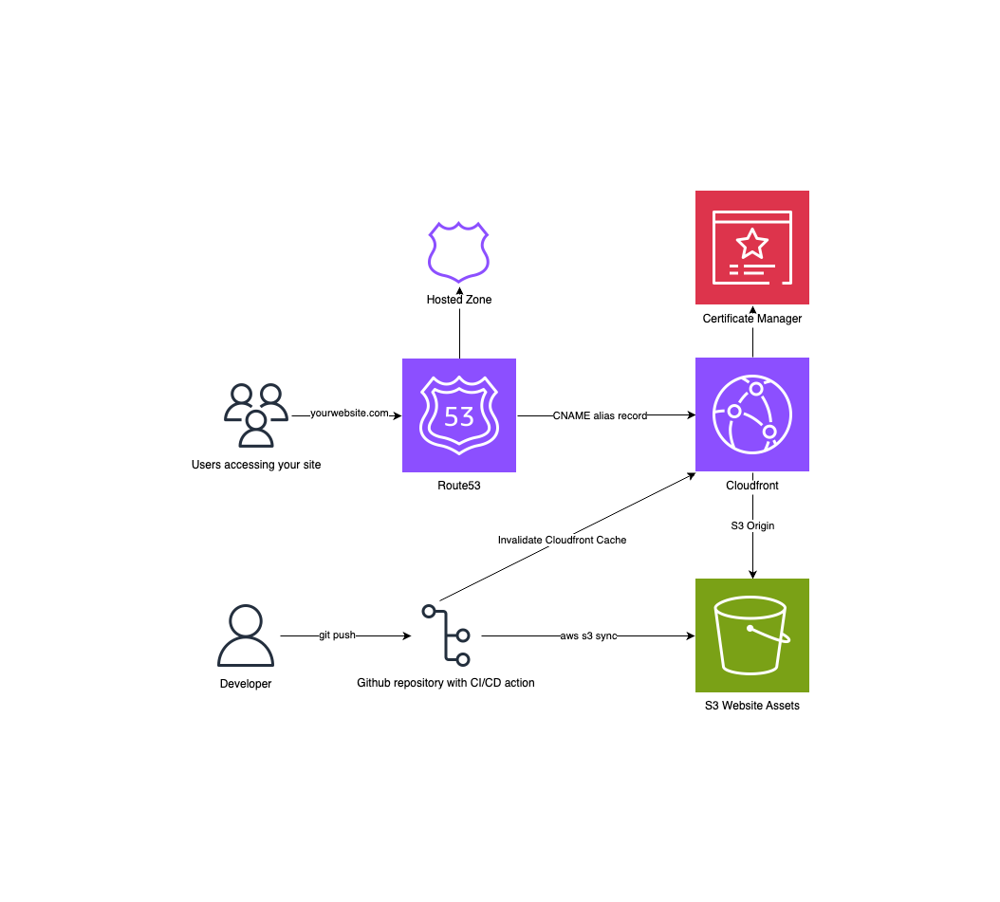

# Grant Starkman's Portfolio Website

Welcome to my personal portfolio website repository! This website showcases my skills, projects, and experience in full-stack development and cloud solutions architecture. It's built using React and Bootstrap for a modern and responsive user interface.

<figure>
  
</figure>

## Features

- **Interactive Navigation:** Explore different sections of the website with ease using the navbar.
- **Dynamic Content:** Learn about my background, skills, and projects through dynamically rendered components.
- **Preloader:** Enjoy a smooth loading experience with a preloader while the content loads.
- **Responsive Design:** Experience consistent usability across various devices with a responsive design.
- **Project Showcase:** Dive into my recent works with detailed project cards, complete with descriptions and demo links.
- **AWS Hosting:** Hosted on AWS for reliable and scalable performance.

## Usage

1. Clone this repository to your local machine.
2. Install dependencies using `npm install`.
3. Run the development server with `npm start`.
4. Explore the website locally on your browser.

## Contributing

Contributions are welcome! If you find any issues or have suggestions for improvements, feel free to open an issue or submit a pull request.

## License

This project is licensed under the MIT License. See the [LICENSE](LICENSE) file for details.

## Acknowledgments

Special thanks to the creators of the libraries and frameworks used in this project, as well as the AWS platform for hosting.
